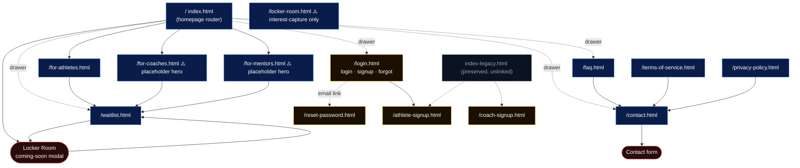
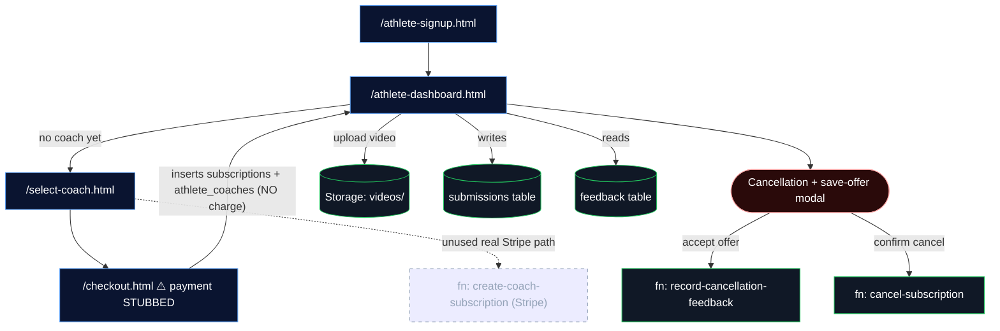
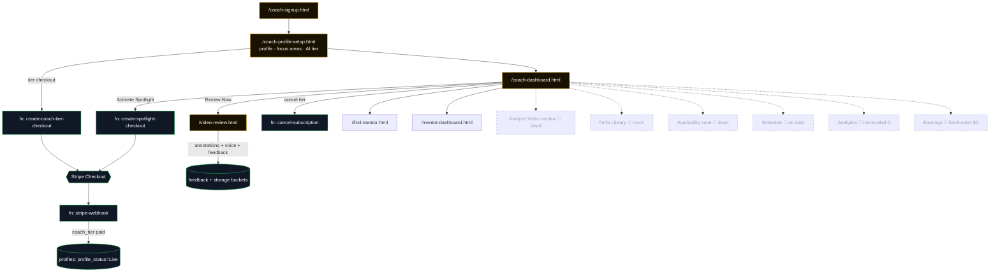
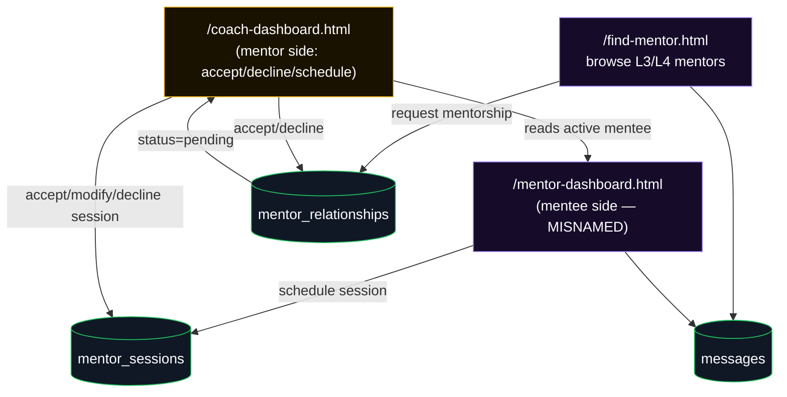
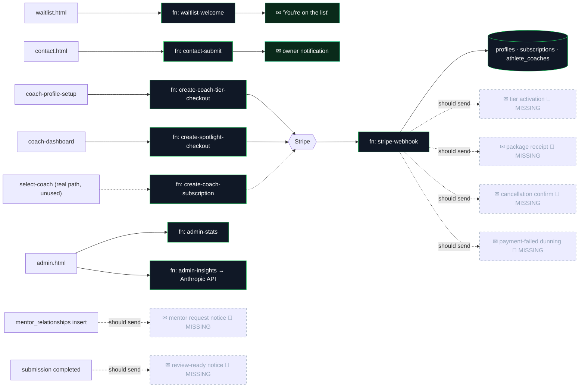

# CoachAnywhere — Site Roadmap & Audit

> **Audit date:** 2026-05-24 · **Scope:** every HTML page, Netlify function, Supabase table, Stripe webhook branch, email trigger, modal and navigation link in the repo.
> **This is an audit, not a build.** Nothing was changed. Every gap is flagged for action, not fixed.
> **Status legend:** ✅ built & working · ⚠️ built but incomplete · 🟡 partially built / placeholder · 🔴 planned / stub / not built.

---

## Deliverable 1 — Visual diagrams

Split into five linked sub-diagrams to stay readable. Dashed nodes/edges = **not built / stubbed / planned**.

### 1A. Public marketing + authentication

### 1B. Athlete experience

### 1C. Coach experience

### 1D. Mentor flow

### 1E. Backend triggers (functions · webhook · emails)

---

## Section 1 — Page inventory

> 27 `.html` files exist. **23 are real pages**; 4 are non-pages (2 preserved homepage references, 2 "ready-for-launch" content snippets). Dev/ops scripts (`seed-demo-data.js`, `reset-demo.js`, `delete-demo-data.js`, `create-stripe-products.js`) are not pages.

### Public / marketing

**`/index.html`** — Homepage router; segments visitors to the three audiences. · Public · Linked from: every page wordmark. · Links to: for-athletes, for-coaches, for-mentors (entry cards + footer CTAs), waitlist, login, faq, contact, (drawer); Locker Room modal. · Actions: 3 entry cards, auto-rotating testimonial carousel, "How it works" animated flow, slide-out drawer, Locker Room coming-soon modal. · Backend: none. · **Status: ✅** · Flags: testimonials are mock; founding-coach trust strip commented out.

**`/for-athletes.html`** — Athlete value proposition + how-it-works + coach showcase. · Public · Linked from: homepage, drawer. · Links to: waitlist?role=athlete. · Actions: animated 3-tile flow, auto-scroll coach carousel (click → popup), static 6-testimonial grid, Locker modal, drawer. · Backend: none. · **Status: ✅** · Flags: coaches & testimonials are mock placeholders; FAQ section commented out; testimonial click-popup handler commented out.

**`/for-coaches.html`** — Coach value proposition + tiers + earnings. · Public · Links to: waitlist?role=coach. · Actions: FAQ accordion, drawer, Locker modal. · Backend: none. · **Status: 🟡** · Flags: **hero `[HEADLINE]`/`[SUBHEADING]` still placeholder**; FAQ answers are placeholder.

**`/for-mentors.html`** — Mentor value proposition. · Public · Links to: waitlist?role=coach (mentor role not yet supported by the form). · **Status: 🟡** · Flags: **placeholder hero**, "$ TBC" earnings, placeholder testimonial + FAQ.

**`/faq.html`** — Standalone FAQ (Athletes/Coaches/Locker Room columns). · Public · Links to: contact (CTA), drawer. · **Status: ✅**

**`/contact.html`** — Contact form. · Public · Form: name/email/role/topic/message + honeypot → `contact-submit` fn → `contact_submissions` insert + Resend owner email. Success state inline. · **Status: ✅** (requires `CONTACT_DESTINATION_EMAIL` env + `migration_contact_submissions.sql` run). · Flags: social links are placeholders.

**`/waitlist.html`** — Waitlist capture. · Public · Form: inserts `waitlist` (client, anon) then fires `waitlist-welcome` fn. `?role=` prefill. Locker checkbox → `interested_in_locker_room`. · **Status: ✅**

**`/locker-room.html`** — Locker Room product landing + interest capture. · Public · Form: `submitInterest()` inserts `locker_room_interest`. · **Status: ⚠️** · Flags: all sessions/recordings/countdowns are hardcoded demo data; "Register — $X" buttons imply payment but only capture interest; **insert `{error}` ignored — always shows success**; not actually linked from the live site (the coming-soon modal points to waitlist, not here).

**`/terms-of-service.html`**, **`/privacy-policy.html`** — Legal. · Public · Links to: contact. · **Status: ✅**

**`/index-legacy.html`**, **`/index-router.html`** — Preserved former homepages, **unlinked** (reachable only by direct URL). · **Status: 🟡 reference** · Flags: index-legacy links to the older `athlete-signup`/`coach-signup`/`locker-room` flow and still contains the founding-cohort copy + an old email address inside comments.

**`/SEO-META-READY-FOR-LAUNCH.html`**, **`/STATS-TESTIMONIALS-READY-FOR-LAUNCH.html`** — Content/snippet references, not navigable pages. · Flags: SEO file's JSON-LD still contains the owner email in a `contactPoint`.

### Authentication

**`/login.html`** — Login / signup / forgot-password portal. · Public, reverse-gated (logged-in users redirected to their dashboard). · Links to: athlete-dashboard, coach-dashboard, coach-profile-setup; email → reset-password. · Actions: `signInWithPassword`; `signUp` + `profiles` insert; `resetPasswordForEmail`. · **Status: ✅** · Flags: **ships a `DEBUG alert()` dumping localStorage keys** when a session doesn't persist; signup profile insert unchecked.

**`/reset-password.html`** — Set-new-password landing from email link. · Token-gated (`PASSWORD_RECOVERY` event, 5s timeout → "expired"). · Action: `auth.updateUser({password})` → login. · **Status: ✅** · Flags: only the set-new half (request lives in login); "Password updated!" screen is immediately overridden by the redirect so it's never seen.

**`/athlete-signup.html`** — Athlete account creation. · Public · Form: `signUp` + schema-aware `profiles` insert incl. `improvement_focus`. → athlete-dashboard. · **Status: ✅**

**`/coach-signup.html`** — Coach account creation. · Public · Form: `signUp` (role=coach) + `profiles` upsert → coach-profile-setup. · **Status: ✅** · Flags: **`mobile` field is collected/required but never stored**; terms mention a required subscription but signup never routes to payment.

### Athlete app

**`/athlete-dashboard.html`** — Athlete hub. · Auth (athlete; coaches bounced to coach-dashboard; auto-creates athlete stub). · Links to: select-coach, login, index. · Sections: Dashboard ✅, My Videos ✅, Reviews/Feedback ✅, Messages ✅, Progress ✅, Goals ✅, Profile ✅, My Coach ✅, **Drills 🔴 hardcoded**, Calendar ⚠️, Payments ✅. · Actions: video upload (90s/100MB cap → `videos/` storage → `submissions` insert), feedback display (drills + voice clips + annotation snapshots/lightbox), cancellation modal (→ `record-cancellation-feedback` on save-offer accept, → `cancel-subscription` on confirm), avatar upload. · Backend: storage `videos`+`avatars`; tables `profiles/submissions/feedback/subscriptions/messages`. · **Status: ✅ (core)** · Flags: drills hardcoded; save-offer pause/discount don't touch Stripe (acknowledged TODO).

**`/select-coach.html`** — Coach directory + focus-area matching. · Auth · Links to: checkout.html?coach=…, login. · Actions: lists real `profiles role=coach` + blended `DUMMY_COACHES`; ranks by blended match score (focus×10 + spotlight 5 + tier 1); filters/sort; coach detail modal. · Backend: reads `profiles`, `messages`. · **Status: ✅ (matching works)** · Flags: **dummy coaches blended into real list** (`SUPPRESS_DUMMY_COACHES=false`); ★ratings hardcoded; leads to stubbed checkout.

**`/checkout.html`** — Confirm package + "pay" for a coach. · Reads session, does not gate. · Action: **`handlePay` is an explicit STUB** — no Stripe, no function call; inserts `subscriptions` (status=active) + `athlete_coaches` directly, then success screen. Promo codes hardcoded (FREE/LAUNCH100). · **Status: ⚠️** · Flags: **records a paid subscription with zero payment**; the real `create-coach-subscription` fn + webhook exist but are bypassed.

### Coach app

**`/coach-profile-setup.html`** — Coach onboarding (profile, focus areas, AI tier rec, packages, tier checkout). · Auth (coach) · Links to: coach-dashboard, login. · Actions: profile upsert; **Focus Areas** multi-select (3 curated + 2 custom); coaching-style multi-select; AI tier recommendation (client-side heuristic); `create-coach-tier-checkout` → Stripe. `?mode=change` re-runs tier flow. · **Status: ✅** · Flags: AI recommendation is a local heuristic (not a model); fortnightly billing variants not built.

**`/coach-dashboard.html`** — Coach hub (sidebar SPA). · Auth (coach; `selected_tier` = "setup complete" gate; athletes bounced). · Links to: find-mentor, mentor-dashboard, coach-profile-setup?mode=change, video-review?sub=, login, index. · Sections: Dashboard ⚠️, Athletes ✅, Reviews ✅, Mentor Requests ✅, Spotlight ✅, Messages ✅, Settings ✅; **Analyze Video 🔴 (Send Feedback button has no handler), Drills 🔴 mock, Availability 🔴 (save dead, only accepting-toggle persists), Schedule 🔴 (no data despite mentor_sessions existing), Analytics 🔴, Earnings 🔴**. · Actions: Spotlight → `create-spotlight-checkout`; cancel tier → cancellation modal → `cancel-subscription`/`record-cancellation-feedback`; My Focus Areas panel → `profiles.update`; mentor accept/decline/schedule → `mentor_relationships`/`mentor_sessions`/`messages`; invite athlete (clipboard). · **Status: ⚠️** · Flags: **DEBUG alert() on session failure**; status pill/filter chips/notif badge decorative; Spotlight L4 "free" path not wired; no `.storage` calls (Analyze upload never uploads).

**`/video-review.html`** — Coach reviews a submission. · Auth (coach) · `?sub=`. · Actions: video transport, drawing/annotation toolkit, **Capture frame** → `review-annotations` bucket, voiceover → `voice-feedback` bucket, MediaPipe pose overlay, `sendFeedback` → `feedback` insert + marks submission completed. · **Status: ✅** · Flags: requires `migration_review_annotations.sql` run; compare-pane "coming soon"; no athlete notification email on send.

### Mentor

**`/find-mentor.html`** — Browse L3/L4 mentor-eligible coaches; request mentorship. · Auth (coach; athletes → select-coach). · Action: `mentor_relationships` upsert (status=pending) + intro `messages`. · **Status: ✅** · Flags: ★ratings hardcoded.

**`/mentor-dashboard.html`** — **Mentee-facing** "Coach Mentorship" dashboard (a coach being mentored). · Auth (coach with active `mentor_relationships`; else → find-mentor). · Actions: schedule session (`mentor_sessions` insert, pending), set focus area (`profiles.mentor_focus_area`), message, view mentor. · **Status: ⚠️** · Flags: **filename implies mentor-side but it's mentee-side** (mentor controls live in coach-dashboard); Resources stubbed; ratings fake.

### Admin

**`/admin.html`** — Owner platform dashboard. · Admin-gated (hardcoded `ADMIN_UUID`; client gate is cosmetic, real gate is server-side in the functions). · Actions: calls `admin-stats` (60s) + `admin-insights` (5min, Anthropic). · Shows KPIs, MRR, mentor funnel, cancellations, top coaches, activity, health. · **Status: ✅** · Flags: revenue computed from in-code price maps (drifts from Stripe); storage counts top-level only.

---

## Section 2 — User flows

### Flow 1 — Curious visitor → Waitlist ✅
1. Land on `/index.html` → click an audience entry card → `/for-athletes.html` (or coaches/mentors).
2. Click "Join the waitlist" → `/waitlist.html?role=athlete` (role prefilled).
3. Submit form → client inserts `waitlist` row → fires `waitlist-welcome` fn → Resend "You're on the list" email. Inline success state.
- **Decision points:** audience choice; Locker-Room interest checkbox.
- **Friction:** for-coaches/for-mentors heroes are still `[HEADLINE]` placeholders — a real visitor sees bracketed copy. **🟠**
- **Broken/missing:** `?role=mentor` isn't supported by the form (mentor page sends `?role=coach`).

### Flow 2 — Athlete signup → coach selection → upload → review ⚠️
1. There is **no public link to `/athlete-signup.html` from the live site** — the homepage/drawer route to `/login.html` and `/waitlist.html`. Signup is reachable only via login's signup tab or the legacy homepage. **🟠 dead path to the dedicated signup page.**
2. Create account (login signup tab or athlete-signup) → `/athlete-dashboard.html`.
3. No coach yet → prompt → `/select-coach.html` → ranked list (real + dummy coaches) → pick → `/checkout.html`.
4. **Checkout is stubbed** — "Pay with Stripe" inserts a `subscriptions` row as *active* with **no charge** and returns to the dashboard. **🔴**
5. Upload a clip (≤90s/≤100MB) → `videos/` storage + `submissions` insert (status pending).
6. Coach reviews in `/video-review.html`; on send → `feedback` row + submission marked completed.
7. Athlete sees written feedback, drills, voice clips, annotation snapshots in the dashboard. **No email tells them the review is ready. 🟠**
- **Friction:** dummy coaches mixed into results; athlete can't tell mock from real.

### Flow 3 — Coach signup → setup → tier → first review → payout ⚠️
1. `/coach-signup.html` (also not linked from the live homepage/drawer — reachable via legacy page or direct) → `/coach-profile-setup.html`.
2. Fill profile + focus areas + coaching style; run AI tier recommendation (local heuristic); pick tier → `create-coach-tier-checkout` → Stripe subscription checkout.
3. On payment, `stripe-webhook` (`coach_tier`) flips `profiles.profile_status=Live`, `tier_status=active`. **No activation email. 🟠**
4. Coach lands on `/coach-dashboard.html`. Athlete arrives via an **invite link the coach copies** (`select-coach.html?coach=<id>`) — there's no organic "athletes find me" surfacing beyond the directory.
5. "Review Now" → `/video-review.html` → send feedback.
6. **Payout: not built.** Earnings section is hardcoded `$0`; no payout integration, no Stripe Connect. **🔴**
- **Broken/missing:** Analyze-Video section's "Send Feedback" button has no handler.

### Flow 4 — Coach goes dormant (no athletes) ⚠️
- Dashboard loads with empty Athletes/Reviews, hardcoded `$0` earnings & `0` analytics, empty Schedule, mock Drills. There's **no onboarding nudge, no "share your profile" prompt beyond the invite-link button, no sample/empty-state guidance** explaining how to get a first athlete. A dormant coach sees a mostly-zeroed dashboard with several dead sections. **🟠 weak empty-state / activation experience.**

### Flow 5 — Mentee coach → find mentor → request → accept → session ✅/⚠️
1. Coach → sidebar "Find Mentor" → `/find-mentor.html` (L3/L4 coaches).
2. Request mentorship → `mentor_relationships` upsert (pending) + intro message. **No email to the mentor. 🟠**
3. Mentor sees it in coach-dashboard "Mentorship" → accept/decline (updates relationship + message).
4. Mentee → `/mentor-dashboard.html` → schedule session → `mentor_sessions` (pending).
5. Mentor accepts/modifies/declines from coach-dashboard (ICS download on accept).
- **Friction:** `mentor-dashboard.html` is misnamed (mentee-side), confusing for maintenance; sessions never surface on the dashboard Schedule/calendar.

### Flow 6 — Athlete cancels subscription ⚠️
1. Dashboard → cancel → 4-step modal: reason → contextual save-offer (discount/pause/switch) → confirm.
2. Accept offer → `record-cancellation-feedback` (records reason; **does not actually apply a pause/discount in Stripe** — acknowledged TODO). Switch routes to select-coach.
3. Decline → confirm → `cancel-subscription` (writes cancellation fields + `cancel_at_period_end` in Stripe **if a Stripe sub id exists**).
- **Broken/missing:** because checkout never created a real Stripe subscription, athlete subs have **no Stripe id** → cancel hits the `no_stripe_id` path (logical-only cancel). **🔴 the whole athlete billing loop is stubbed end-to-end.** No cancellation confirmation email.

### Flow 7 — Coach cancels tier ⚠️
1. Settings → cancel-tier card (visible only if `tier_status=active && !tier_cancelled_at`) → same modal.
2. Confirm → `cancel-subscription` (type `coach_tier`) → Stripe `cancel_at_period_end` + DB stamp.
3. `stripe-webhook` `customer.subscription.deleted` later sets `profile_status=Cancelled`.
- **Missing:** **nothing happens to the coach's athletes** when a coach cancels — no reassignment, no athlete notification, no hiding from the directory until period end. **🟠** No cancellation email.

### Flow 8 — Spotlight activation ✅/⚠️
1. Coach-dashboard → Spotlight → Activate → `create-spotlight-checkout` → Stripe (L1–L3) → webhook `spotlight` sets `spotlight_active=true` (+30d expiry).
2. **L4 path returns `{free:true}` but nothing activates it** (no Stripe session ⇒ no webhook; client shows "auto-activation isn't wired yet"). **🟠 L4 spotlight never turns on.** No confirmation email.

### Flow 9 — Contact form ✅
form → `contact-submit` (honeypot, validate, rate-limit) → `contact_submissions` insert + Resend owner email (reply-to submitter). Inline success.
- **Dependency:** needs `CONTACT_DESTINATION_EMAIL` env + migration run; otherwise saves nothing / emails nothing.

### Flow 10 — Locker Room link ✅ (as a teaser)
Nav/portal "The Locker Room" → coming-soon modal → "Join the waitlist" → `/waitlist.html`. The standalone `/locker-room.html` interest page is **not** what the modal links to; it's effectively orphaned.

### Flow 11 — Admin review ✅
`/admin.html` (UUID gate) → `admin-stats` (KPIs/MRR/funnel/cancellations/health) + `admin-insights` (Anthropic narrative). Read-only; no admin actions (can't suspend a coach, refund, edit a profile, or moderate from here). **🟡 observability only.**

**Flows the brief didn't list but exist / matter:** password reset (✅), coach "change tier" via `?mode=change` (✅), athlete "change coach" (→ select-coach, ✅), mentor *session* lifecycle (separate from the mentorship-request lifecycle).

---

## Section 3 — Gaps & to-be-built

| Feature | Where it lives | Why needed | Depends on | Priority |
|---|---|---|---|---|
| **Real athlete package payment** | checkout.html | Currently grants coaching with no charge — zero revenue capture | wire `create-coach-subscription` (or a subscription-mode equivalent) + webhook | 🔴 launch-blocking |
| **Subscription (recurring) vs one-shot for packages** | create-coach-subscription.js / webhook | `coach_package` is `mode:payment` (one-shot) but treated as recurring; can't renew/cancel | Stripe product model decision | 🔴 launch-blocking |
| **Coach payouts (Stripe Connect)** | coach-dashboard Earnings | Coaches can't get paid; earnings hardcoded $0 | real payments first | 🔴 launch-blocking |
| **Transactional emails** (tier activation, package receipt, spotlight, cancellation, dunning, mentor-request, review-ready, new pairing) | stripe-webhook, mentor flow, video-review | Users get no confirmations; silent past_due | Resend (already wired) | 🟠 near-term |
| **Coach-dashboard Schedule/calendar** | coach-dashboard Schedule | `mentor_sessions` exist but never render on a calendar | none | 🟠 near-term |
| **Availability settings save** | coach-dashboard Availability | Selects + Save button are dead (only accepting-toggle persists) | profiles columns | 🟠 near-term |
| **Analyze-Video upload from coach dashboard** | coach-dashboard Analyze | "Send Feedback" button has no handler; section non-functional (real review path is video-review.html) | decide if this section is needed at all | 🟠 near-term |
| **Drills library (athlete + coach)** | both dashboards | Hardcoded mock cards; "Add Drill"/"Start drill" dead | drills table | 🟡 post-launch |
| **Analytics dashboards** | coach + admin | Hardcoded zeros | event data | 🟡 post-launch |
| **Spotlight L4 activation** | create-spotlight-checkout / dashboard | L4 "free" never actually activates | small DB write | 🟠 near-term |
| **Save-offer (pause/discount) execution** | cancellation modals | Offers recorded but never applied in Stripe | Stripe subscription edits | 🟠 near-term |
| **Coach-cancel → athlete handling** | webhook / coach flow | No reassignment/notice when a coach leaves | emails + directory rules | 🟠 near-term |
| **Real Locker Room product** | locker-room.html | All content is demo; no live sessions/payments | product build | 🟡 post-launch |
| **Mentor `?role=mentor` on waitlist** | waitlist.html | for-mentors sends `?role=coach`; no mentor option | form field | 🟡 minor |
| **for-coaches / for-mentors hero copy** | those pages | Still `[HEADLINE]` placeholders | copywriting | 🟠 near-term (pre-launch) |
| **Organic athlete↔coach discovery** | select-coach / coach onboarding | Coaches rely on copy-paste invite links | directory polish | 🟡 post-launch |
| **Admin actions** (suspend/refund/moderate) | admin.html | Currently read-only observability | admin write fns | 🟡 post-launch |
| **`custom_focus_areas` in matching** | select-coach | Stored but intentionally excluded from match | — | nice-to-have |
| **Server-side / indexed matching** | select-coach | Matching is client-side; GIN indexes unused | move to query | nice-to-have |

---

## Section 4 — Backend audit

### Netlify functions
| Function | Trigger | Does | Tables / services | Status |
|---|---|---|---|---|
| `stripe-webhook.js` | Stripe webhook | Dispatches events → DB writes (service role) | profiles, subscriptions, athlete_coaches; Stripe verify | ✅ |
| `create-coach-tier-checkout.js` | coach-profile-setup | Tier subscription checkout (`coach_tier`) | Stripe | ✅ |
| `create-spotlight-checkout.js` | coach-dashboard | Spotlight checkout (`spotlight`); L4→`{free}` | Stripe | ⚠️ L4 unwired |
| `create-coach-subscription.js` | select-coach (per comments) — **not used by live checkout.html** | One-shot package checkout (`coach_package`, `mode:payment`) | Stripe | ⚠️ unused + price from client |
| `cancel-subscription.js` | cancellation modals | JWT+ownership, stamps cancel fields, Stripe `cancel_at_period_end` | profiles/subscriptions; Stripe | ✅ |
| `record-cancellation-feedback.js` | save-offer accept | Records reason/offer only (no Stripe) | profiles/subscriptions | ✅ |
| `admin-stats.js` | admin.html (60s) | KPIs/MRR/funnel/health (service role, read-only) | most tables + auth + storage | ✅ |
| `admin-insights.js` | admin.html (5min) | Anthropic narrative over stats | Anthropic API | ✅ |
| `waitlist-welcome.js` | waitlist.html | Verifies membership → Resend welcome | waitlist; Resend | ✅ |
| `contact-submit.js` | contact.html | Honeypot/validate/rate-limit → insert + Resend owner | contact_submissions; Resend | ✅ |

### Stripe webhook branches
`checkout.session.completed` → `spotlight` / `coach_tier` / `coach_package`; `invoice.payment_succeeded` (renew/reactivate); `customer.subscription.deleted` (cancel); `invoice.payment_failed` (past_due). **No `customer.subscription.updated`.** **No emails on any branch.** `coach_package` write errors unchecked.

### Emails (Resend) — built vs missing
- ✅ Built: waitlist welcome; contact-form owner notification.
- 🔴 Missing (should exist): coach tier activation, athlete package receipt, spotlight activation, cancellation confirmation, payment-failed dunning, mentor-request notification, review-ready notification, new athlete↔coach pairing.

### Supabase RLS (high level)
- ✅ RLS in place: submissions, feedback, subscriptions, athlete_coaches, mentor_relationships/sessions, avatars/review-annotations storage, waitlist (write-only), contact_submissions (service-role-only).
- 🟠 Verify: `locker_room_interest` insert policy (page ignores errors so a blocked insert is invisible); confirm `profiles` exposes only safe columns to anon (select-coach/find-mentor read it with the anon key).
- Note: matching/listing reads `profiles` client-side with the anon key — confirm no sensitive coach columns (Stripe ids, cancellation detail) are anon-readable.

---

## Section 5 — Issues found (prioritised)

### 🔴 Critical
1. **checkout.html grants paid coaching with no payment** — inserts an *active* subscription, no Stripe charge.
2. **Athlete billing loop is stubbed end-to-end** — no Stripe sub id ⇒ cancellation can't reach Stripe (`no_stripe_id`).
3. **Coach packages use one-shot `mode:payment`** but are modelled/handled as recurring subscriptions — they can never renew or cancel via Stripe.
4. **`create-coach-subscription.js` trusts a client-supplied price** (`packagePrice*100`, no validation) — amount-tampering risk if it's ever wired in.
5. **No payout mechanism for coaches** — earnings are hardcoded $0; revenue can't reach coaches.
6. **DEBUG `alert()` dumping localStorage ships to users** in login.html and coach-dashboard.html on session failure.

### 🟠 Significant
7. No transactional emails for activation, receipts, cancellation, dunning, mentor requests, or review-ready.
8. Coach dashboard sections dead/stub: Analyze-Video (Send Feedback no handler), Availability save, Schedule (no data), Analytics, Earnings, Drills.
9. Spotlight **L4 never activates** (free path unwired).
10. Save-offer pause/discount **recorded but never applied** in Stripe.
11. **Dedicated signup pages aren't linked** from the live homepage/drawer (only login + waitlist are) — `athlete-signup.html`/`coach-signup.html` are effectively orphaned for new traffic.
12. **for-coaches.html & for-mentors.html ship placeholder `[HEADLINE]` hero copy** — visible bracketed text to real visitors.
13. Coach cancellation does nothing to their **athletes** (no notice/reassignment).
14. `mentor_sessions` never surface on any **calendar/Schedule** view.
15. Webhook has **no `customer.subscription.updated`** handler.
16. select-coach **blends dummy coaches** into the real ranked list (`SUPPRESS_DUMMY_COACHES=false`).
17. `mentor-dashboard.html` is **misnamed** (mentee-facing) — maintenance hazard.
18. locker-room.html **ignores its insert error** (always shows success) and is **orphaned** (modal links to waitlist instead).
19. Dormant-coach experience is a mostly-zeroed dashboard with several dead tabs and no activation guidance.
20. Contact form has a hard **deploy dependency** (`CONTACT_DESTINATION_EMAIL` env + migration) that fails silently if unmet.

### 🟡 Minor
21. reset-password "updated!" screen never shown (immediate redirect).
22. coach-signup **`mobile` field discarded**; terms mention a subscription it never collects.
23. admin.html client gate is cosmetic (server gate is the real one — acceptable, but note).
24. Hardcoded ★4.9 ratings across select-coach / find-mentor / mentor-dashboard.
25. `for-mentors` earnings "$ TBC" + placeholder testimonial/FAQ.
26. `index-legacy.html` / `index-router.html` reachable by direct URL; legacy still references old signup flow + old email (in comments).
27. SEO/STATS "ready-for-launch" snippet files contain stale data + owner email (JSON-LD contactPoint).
28. Matching runs client-side; `focus_areas` GIN indexes unused; `custom_focus_areas` never matched.
29. Coach-dashboard status pill / filter chips / search / notification badge are decorative (no handlers).
30. admin revenue computed from in-code price maps (drifts from Stripe); storage counts top-level files only (undercounts).
31. Several migrations' run-status was previously uncertain (`migration_review_annotations`, `migration_contact_submissions`) — confirm applied.
32. `coach_package` write errors in the webhook are unchecked (silent).

---

*End of audit. Generated read-only; no code was modified.*
